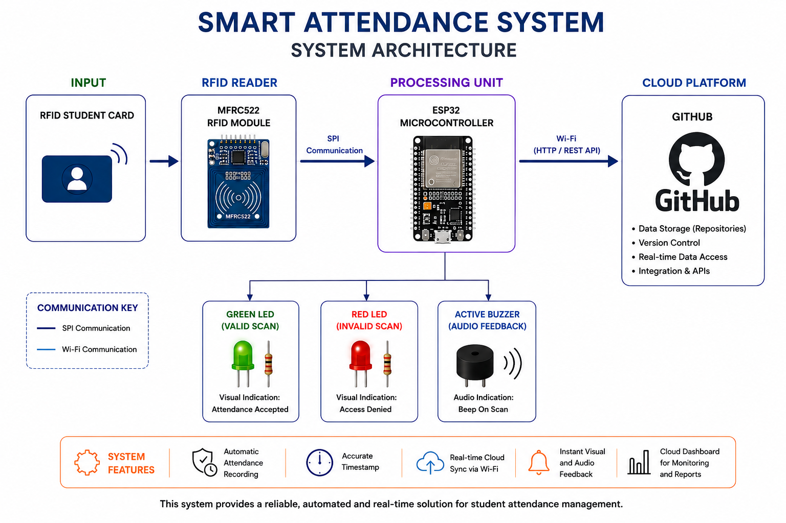
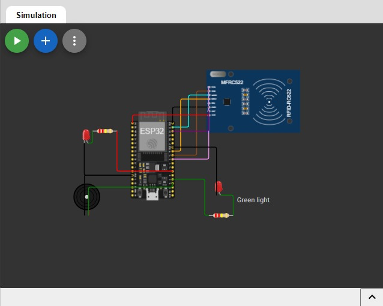

# 👥 Group Members

| Student Name | Student Number | Role / Responsibility |
|---|---|---|
| Redah Gamieldien | 222641681 | Testing Lead |
| Lyle Solomons | 230123872 | Software Lead |
| Qaasim Isaacs | 222544422 | Hardware Lead |
| Ethan Williams | 221454780 | Documentation Lead |

---

## 💡 Project Idea & Problem Statement
## Problem Statement

Currently, student identification cards are mainly used only to access campus facilities. However, classroom attendance is still recorded manually using attendance sheets.

This creates several problems:

- Attendance sheets can be lost or damaged  
- Students may sign attendance for absent friends  
- Manual attendance recording is time consuming  
- Attendance tracking becomes unreliable and prone to human error  

---

## Proposed Solution

We developed a **Smart Attendance System** using RFID and ESP32 with real-time monitoring.

### System Flow:
- RFID card is scanned
- ESP32 reads UID
- Attendance is recorded automatically
- LED + buzzer provide feedback
- Data is sent via Wi-Fi
- GitHub stores project documentation

---

## Objectives

1. Automate attendance tracking  
2. Improve accuracy and efficiency  
3. Prevent proxy attendance  
4. Demonstrate IoT application in education  

---

# 🏗️ System Architecture & Design

## Design Decisions

- ESP32 chosen for Wi-Fi + processing power  
- MFRC522 used for RFID scanning  
- SPI communication ensures fast data transfer  
- LEDs + buzzer for feedback system  
- GitHub for version control  
- Designed for scalability  
---

## 🔧 Hardware Components

| Component | Description | Quantity | Purpose |
|---|---|---|---|
| ESP32 | Microcontroller | 1 | Main controller |
| MFRC522 | RFID reader | 1 | Reads student cards |
| RFID Tags | Student cards | Multiple | Identification |
| Green LED | Indicator | 1 | Success signal |
| Red LED | Indicator | 1 | Failure signal |
| Buzzer | Sound output | 1 | Audio feedback |
| 220Ω Resistors | Protection | 2 | LED safety |
| Jumper Wires | Connections | Multiple | Wiring |
| Breadboard | Prototype | 1 | Testing |
| Enclosure | Housing | 1 | Final casing |

---

## 💻 Software & Technologies

| Tool | Purpose |
|---|---|
| Arduino IDE | Programming ESP32 |
| GitHub | Version control |
| Wokwi | Simulation |
| C++ | Firmware language |
| ESP32 Wi-Fi Library | Connectivity |
| MFRC522 Library | RFID communication |

---

## 🔌 Circuit Diagram / Wiring

| Component Pin | ESP32 Pin |
|---|---|
| SDA | GPIO 5 |
| SCK | GPIO 18 |
| MOSI | GPIO 23 |
| MISO | GPIO 19 |
| RST | GPIO 22 |
| VCC | 3.3V |
| GND | GND |
| Green LED | GPIO 13 |
| Red LED | GPIO 12 |
| Buzzer | GPIO 14 |
---

# Key Functions

| Function Name | Description |
|---|---|
| `setup()` | Initializes hardware, WiFi, RFID, and Firebase |
| `loop()` | Handles RFID scanning and attendance logging |
| `getTimeStamp()` | Retrieves current date and time |
| `instantBeep()` | Plays short buzzer sound |
| `accessGranted()` | Indicates successful scan |
| `accessDenied()` | Indicates failed scan |
| `http.GET()` | Retrieves data from Firebase |
| `http.POST()` | Sends attendance data to Firebase |
| `deserializeJson()` | Parses Firebase JSON data |
| `rfid.PICC_HaltA()` | Stops RFID communication after scan |

---
